# Portfolio Metrics Extraction — PoC

A small proof-of-concept ("crawl" phase) that takes a folder of portfolio-company PDF reporting
packages, extracts key financial and operating metrics with full provenance, and organizes them
into a reviewable, dashboard-ready structure.

Design rationale and scoping decisions live in [specs/spec.md](specs/spec.md).

## Pipeline



<!-- Diagram source: assets/pipeline.mmd — re-render with:
     npx -y @mermaid-js/mermaid-cli -i assets/pipeline.mmd -o assets/pipeline.svg -b white -->

Every extracted value carries provenance — source file, page, verbatim label, and whether it came
from a table, commentary, or a footnote — and is string-matched back into the source text as a
guard against LLM hallucination. Anything the pipeline is unsure about becomes a row in
`flags.csv` instead of a silent guess.

## Quickstart

```bash
python -m venv .venv && source .venv/bin/activate
pip install -r requirements.txt

cp .env.example .env   # then paste your OpenAI API key + model ID into .env

# put the report PDFs in a local folder (data/ is gitignored for exactly this), then:
python -m src.pipeline --input data
```

Committed outputs from the sample run are in [output/](output/), so results can be reviewed
without running anything.

Run the tests (no API key needed — they cover the deterministic layers using JSON fixtures):

```bash
pytest
```

`demo.ipynb` is committed with outputs executed, so it can be read on GitHub without running
anything. To run it interactively (it only reads the committed `output/` CSVs — no API key
needed): `pip install jupyterlab && jupyter lab demo.ipynb`, or open it in your IDE and select
this project's `.venv` as the kernel.

## Outputs

| File | What it is |
|---|---|
| `output/metrics_long.csv` | Tidy fact table: one row per extracted metric + provenance columns |
| `output/pivot.csv` | Companies × quarters for the canonical metrics — the human-review view |
| `output/flags.csv` | Everything uncertain: errors, unverified values, duplicates, missing currency |

### `metrics_long.csv` data model

| Column | Meaning |
|---|---|
| `company` | Canonical company name (renames resolved, e.g. FleetLink → ApexFreight) |
| `company_as_reported` | Company name exactly as printed in the source |
| `canonical_metric` | Portfolio-wide metric name from `config/metrics.yaml`, empty if non-canonical |
| `verbatim_label` | Metric label exactly as printed |
| `value` | Value exactly as printed (e.g. `$8.4M`, `78%`, `(0.75M)`) — see limitations |
| `unit` / `currency` | Reported scale and ISO currency; currency empty when not determinable |
| `quarter` / `year` | Reporting period the value belongs to, split for sorting/filtering |
| `period_basis` | monthly / quarterly / ltm / point_in_time — guards e.g. monthly-vs-quarterly burn |
| `source_file` / `page` / `location` | Where the value came from (file, page, table/commentary/footnote) |
| `source_type` | standalone report vs portfolio snapshot (drives precedence) |
| `report_period` | Period of the *document* the value came from (differs for restatements) |
| `note` | Restatements, stated label equivalences, caveats as disclosed |
| `non_canonical` | True when the metric has no canonical mapping (kept, not dropped) |
| `superseded` | True when a higher-precedence source reports the same data point |

Keeping both `canonical_metric` and `verbatim_label` means terminology can keep drifting
without losing the original disclosure.

## Configuration

- `.env` — `OPENAI_API_KEY`, `OPENAI_MODEL`, `LOG_LEVEL` (see `.env.example`)
- `config/metrics.yaml` — the canonical metric dictionary (`metrics:` → name → definition,
  matching the canonical list in the spec). Definitions are
  fed to the extraction prompt; the model assigns each extracted metric to a canonical name,
  and the normalizer validates the assignment against this list. Adding a metric is a config
  change, not a code change:

  ```yaml
  - name: ebitda
    description: >
      EBITDA explicitly reported for the period; exclude adjusted variants
      unless no unadjusted figure is given.
  ```

  Append to the `metrics:` list and re-run — the definition flows into the prompt and the
  validation set automatically.

## Repository structure

| Path | Responsibility |
|---|---|
| `config/metrics.yaml` | Canonical metric dictionary (name + definition) |
| `specs/spec.md` | One-page spec: goal, observed data traps, approach, scope decisions |
| `src/schema.py` | Pydantic extraction schema (per-metric provenance fields) |
| `src/ingest.py` | PDF → text per page (pdfplumber) |
| `src/extract.py` | Prompt assembly + OpenAI structured-output call |
| `src/normalize.py` | Canonical validation, entity resolution, precedence, dedup |
| `src/checks.py` | Provenance guard + data-quality checks → flag rows |
| `src/pipeline.py` | CLI + orchestration + output writing |
| `tests/` | Unit tests for the deterministic layers (no API key needed) |
| `demo.ipynb` | Executed walkthrough of the outputs |
| `output/` | Committed results of the sample run |

## Approach & key assumptions

Reading the sample PDFs like an analyst first revealed that the hard problem is not PDF parsing
but inconsistency: labels drift across quarters ("Total Billings" → "Recognized Revenue"), one
company rebranded mid-history (FleetLink → Apex Freight), currencies differ (GBP; some values
carry no symbol at all), one report restates another's numbers, some metrics appear only in
commentary prose, and a portfolio snapshot overlaps four standalone reports. The design responds
to that: an LLM does the *reading* (open extraction of every metric, verbatim, with provenance,
plus semantic assignment to canonical metrics defined in `config/metrics.yaml`), and
deterministic Python does the *rules* (validation, entity resolution, source precedence,
duplicate handling, checks). Anything uncertain becomes a row in `flags.csv` rather than a
silent guess, and a provenance guard string-matches every extracted label and value back into
the source text as a hallucination check.

Key assumptions:

- PDFs are text-native (true for the sample set); scanned documents are out of scope.
- Currency is recorded, not converted; cross-currency comparison needs an FX policy (next step).
- A later filing restating an earlier period supersedes it; both values are retained, the loser
  flagged `superseded`.
- Standalone company reports take precedence over the portfolio snapshot where they overlap.
- Conflicts *within* one document (two different values mapped to the same metric) are never
  auto-adjudicated — both stay live and are flagged for human review.

### Sample run (24 report PDFs, model `gpt-5.4-mini`, Aug 16 2026)

417 rows extracted (177 canonical, 28 superseded by precedence), ~2.5 minutes, zero failed
documents. Highlights: NovaCloud revenue forms a clean 5-quarter series across its label change
("Total Billings" → "Recognized Revenue"); ApexFreight's series is continuous across the
FleetLink rebrand; PeopleFlow Q1 2025 correctly shows the restated 4.6M. Metrics reported for
NovaCloud in both the snapshot and its standalone report agree — a free cross-source
consistency check. 9 warnings, each a genuine catch: missing currencies (MediSight and
ApexFreight print bare numbers like "6.8M"), and the provenance guard catching the model
transcribing "+ $0.2M" for a value typeset as "+$0.2M".

Because extraction is an LLM call, results vary slightly between runs (e.g. an earlier run
mapped ClearPay's "Net Revenue" and "Total Recognized Revenue" both to revenue — correctly
surfaced as a conflict warning rather than silently resolved). Measuring and tightening that
variance is what the eval harness in next steps is for.

## Known limitations

- **Values are verbatim strings, not parsed numbers** — `$8.4M` stays `$8.4M`. Deliberate for
  the crawl phase (provenance-first, no silent unit math); numeric parsing with sign/scale
  handling is the first transformation a dashboard layer would add.
- **Extraction accuracy is spot-checked, not measured** — no labeled eval set yet (next step #1).
- **Currency and units are recorded, never converted.**
- **Scanned/image PDFs are out of scope** — ingest fails fast with a clear error, and the
  document becomes an error flag.
- **Similar labels are not always economically equivalent** — canonical mapping follows the
  document's stated definitions and footnotes, and flags conflicts rather than adjudicating them.
- **Processing is sequential** — ~6s per document; fine at 25 documents, parallelize later.

## Next steps ("walk" phase)

1. **Eval harness** — hand-labeled ground truth for the sample set; per-metric precision/recall,
   regression-tested across prompt/model versions.
2. **Human review queue** — route low-confidence and flagged extractions to an analyst;
   approvals become labeled training/eval data.
3. **Governed metric dictionary** — analysts own `metrics.yaml`; definitions versioned.
4. **Database + dashboard** — `metrics_long.csv` becomes a fact table; the pivot becomes a BI view.
5. **Cross-source consistency as a feature** — snapshot-vs-standalone comparison generalizes to
   automatic validation wherever two documents report the same fact.
6. **Document classification gate** — reject or route non-report PDFs before extraction; the
   sample run excludes the challenge brief PDF for exactly this reason.
7. **Footnote-driven alias resolution** — extraction already captures stated equivalences in the
   `note` column (e.g. LendBridge's "equivalent to 'Credit Loss Rate' used in Q3–Q4 2024");
   use them to unify renamed non-canonical metrics into continuous series.
